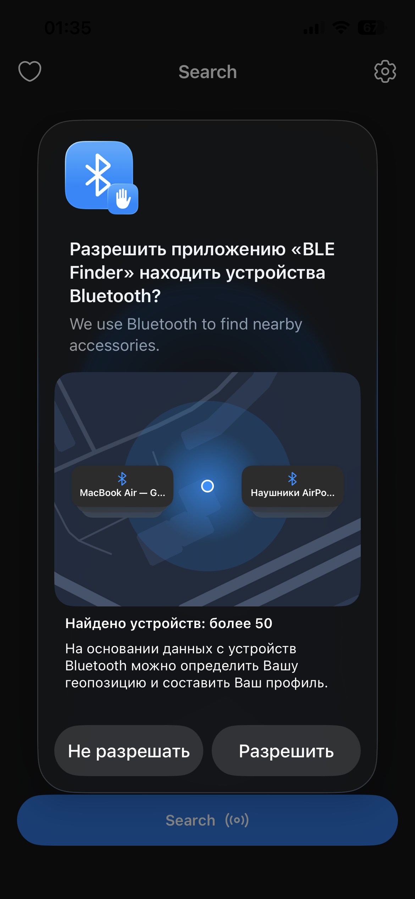
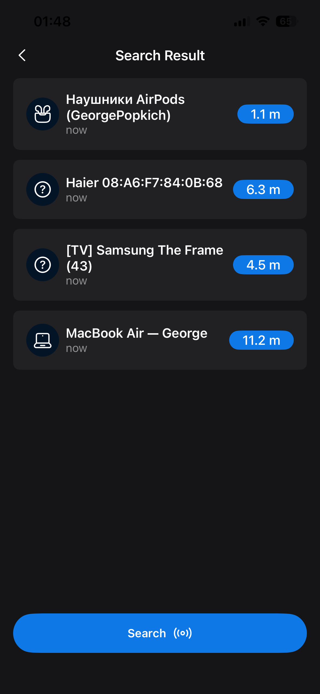
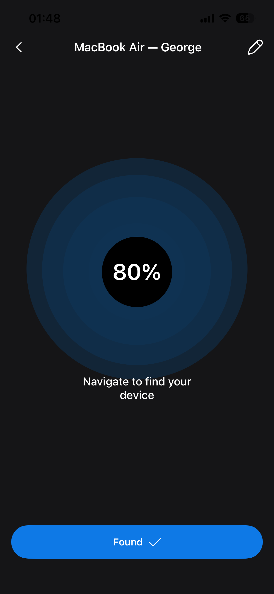
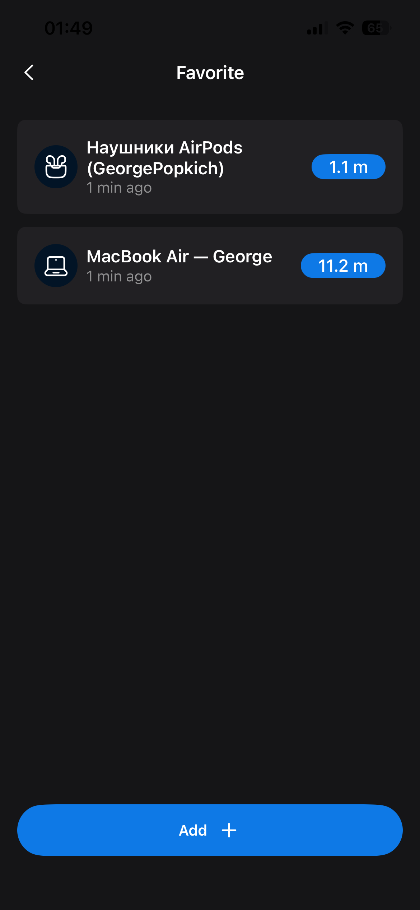

# BluetoothFinder

**BluetoothFinder** is an iOS application written in **SwiftUI** that allows users to discover nearby Bluetooth devices, monitor their proximity in real time, and save favorites for quick access.  

The app calculates how close a device is and displays the result in **percentages**, making it easy to estimate distance.  
Favorite devices are stored in **CoreData** and always show their current proximity to the user.  

---

## Features
- Scan and discover Bluetooth devices nearby  
- Display proximity of devices in **percentages**  
- Save favorite devices for quick access  
- Favorites screen shows updated distance in real time  
- Built with SwiftUI for a smooth and modern UI  
- CoreData persistence for saved devices  

---

## Requirements
- iOS 16.0+  
- Xcode 15+  
- Swift 5.9+  

---

## 📦 Technologies
- Swift / SwiftUI  
- CoreData  
- CoreBluetooth (for BLE scanning)  

---

## Screenshots

<p float="left">
  
  
  
  
</p>

---

## Installation
1. Clone the repository:  
   ```bash
   git clone https://github.com/your-username/BluetoothFinder.git
   cd BluetoothFinder
